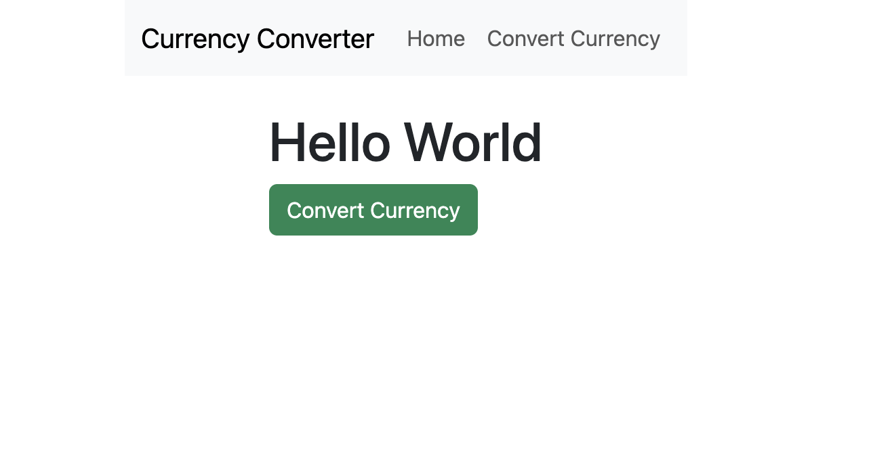
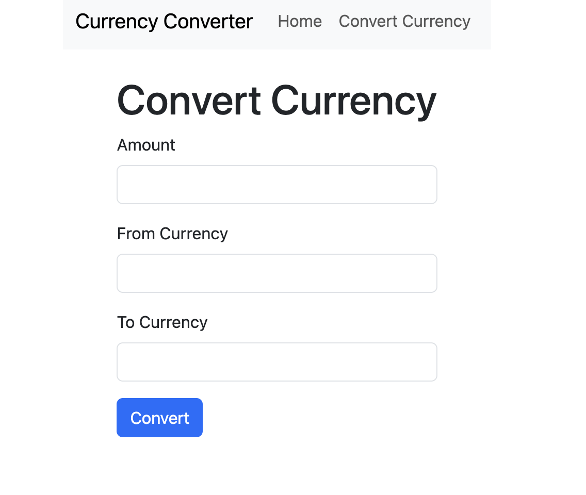
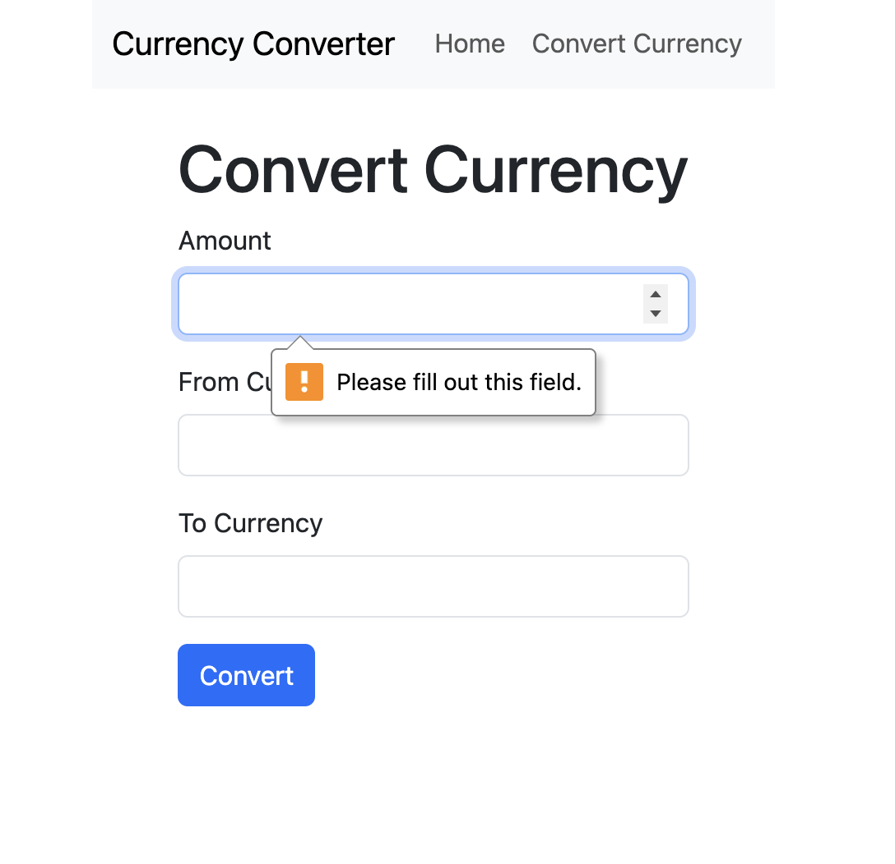
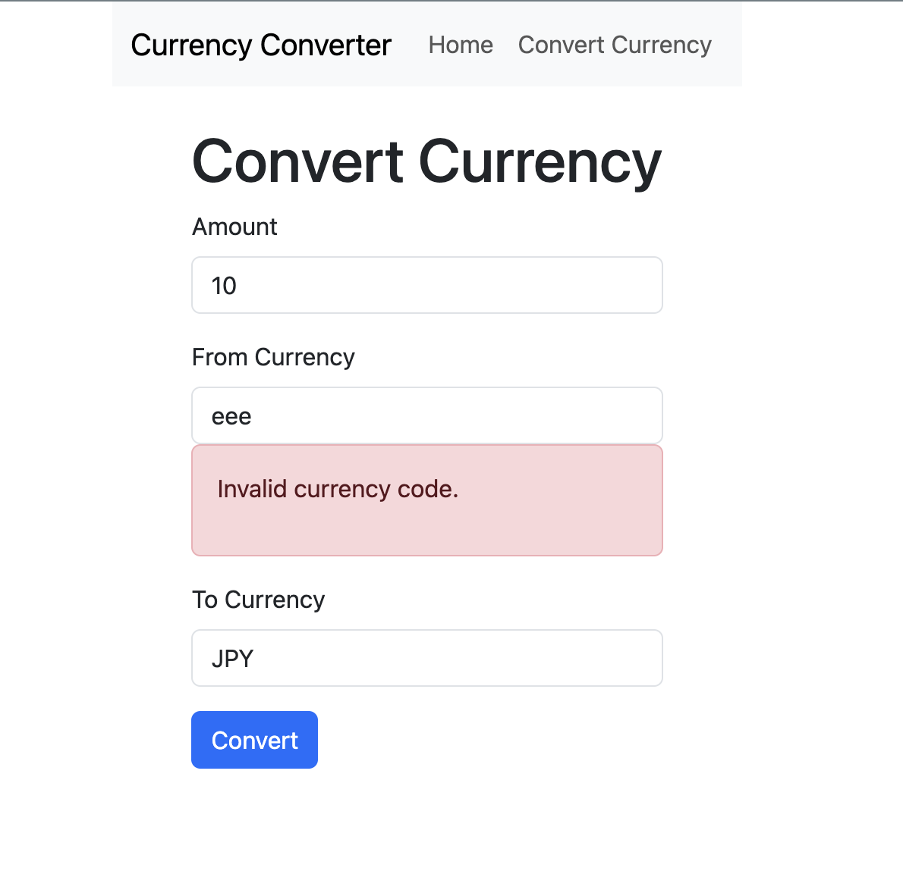
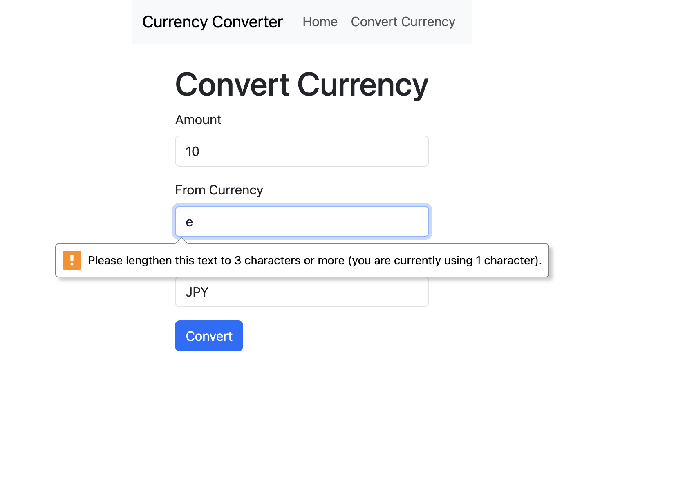
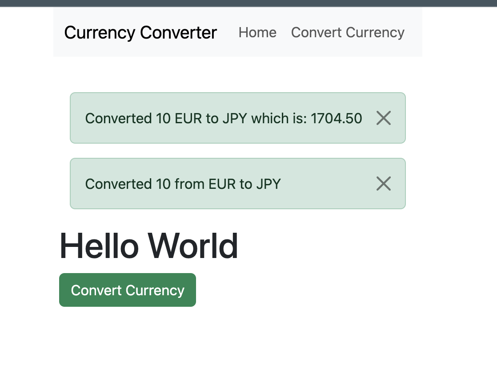

# The Forex Conveter Assessment
This is a challenge to create a currency converter that will tell you the value of one currency in a second specified currency. 

## Table of Contents

- [Overview](#overview)
  - [Features](#features)
  - [Sreenshot](#screenshots)
- [Built With](#built-with)
- [Getting Started](#getting-started)
  - [Setup Instructions](#setup-instructions)
  - [Continued development](#continued-development)
- [Routes](#routes)
- [Author](#author)
- [Acknowledgments](#acknowledgments)

---

## Overview
This is a challenge to create a currency converter that will tell you the value of one currency in a second specified currency. The user can select the first currency and the second currency, and then enter the amount they want to convert. The app will then display the converted value.

### Features
- User can select the first currency and the second currency by entering a three letter ISO 4217 code.
- Codes are validated to ensure they are valid ISO 4217 codes.
- User can enter the amount they want to convert.
- The app will display the converted value.

### Screenshots

## Built With
- Python
- Flask
- HTML
- CSS
- Bootstrap
- Jinja2

## Getting Started
To get a local copy up and running follow these simple steps.

### Setup Instructions
1. Clone the repo
2. Install the required packages by running `pip install -r requirements.txt`
3. Run the app by executing `python app.py`
4. Open your browser and go to `http://

### Continued development
This is a simple app and the UI is a bit basic. I would like to improve the UI and add more features in the future. 

## Routes
- `/` - The home page where the user can enter the currencies and amount to convert.
- `/convert` - The route that handles the conversion logic and returns the converted value.

## Author
- Github - [DNel2](https://github.com/TechEdDan2)
- Frontend Mentor - [@TechEdDan2](https://www.frontendmentor.io/profile/TechEdDan2)

## Acknowledgments
The YouTubers and other educational resources I have been learning from include: Coder Coder (Jessica Chan), BringYourOwnLaptop (Daniel Walter Scott), Kevin Powell, Udemy courses, and Bootcamp (Colt Steele) 